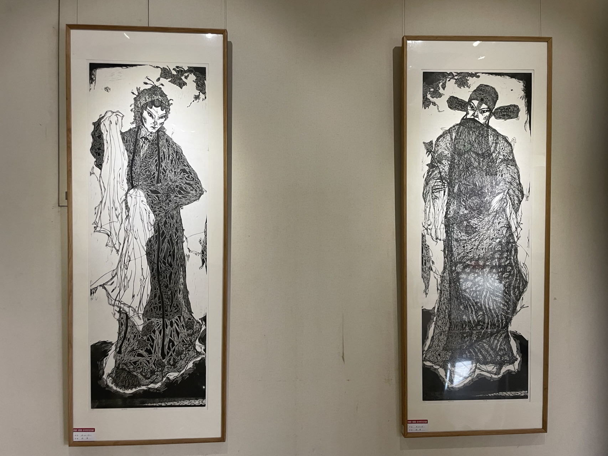

A ML beginner, this website is recording something.

# Welcome to my homepage

## Website
- [new site](https://www.cnblogs.com/blueflylabor)
- [old site](https://www.cnblogs.com/Carrawayang)
- [blueflylabor.github.io](https://blueflylabor.github.io)

Hi guys, welcome!

Here is blueskylabor.

### Languages

### Programming Languages

### Tools

### Learning

### Stats

[jekyll-paper]: https://github.com/ghosind/Jekyll-Paper
[jekyll-paper-issues]: https://github.com/ghosind/Jekyll-Paper/issues